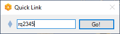

# Quick Link

A tool to quickly open a Spira Ticket in your webbrowser.

Based on the .NET Framework 4.7.2.

It opens as a systray application. 
* A right click gives a context menu to open SpiraPlan (hard-coded URL) or exit _Quick Link_.
* A left click opens a window to enter a ticket number. Hit _Enter_ to navigate your browser to the desired ticket (hard-coded instance and product).

## Enter a Ticket Number

Open the _Quick Link_ input window and enter the ticket number.
Hit _Escape_ or click away to close it again.

So far, _Quick Link_ supports requirements and incidents.

By the way: Spira automatically selects the corresponding software product since ticket numbers are globally unique per instance.

### Requirements

Enter a number (e.g., "1234") and hit _Enter_. You can also add "RQ", e.g. "rq1234".

This makes requirements the assumed default ticket type. 

### Incidents

You must prefix with "IN", e.g. "in4567".

## Global Hotkey Support

Hit _CTRL + WIN + R_ to open the _Quick Link_ input field. 
It works from everywhere.

Note, _Quick Link_ may not start if this hotkey is already in use by another application.
